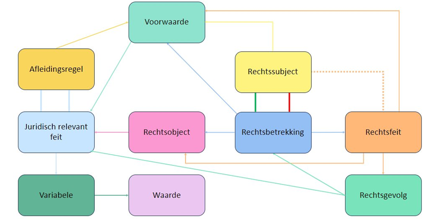
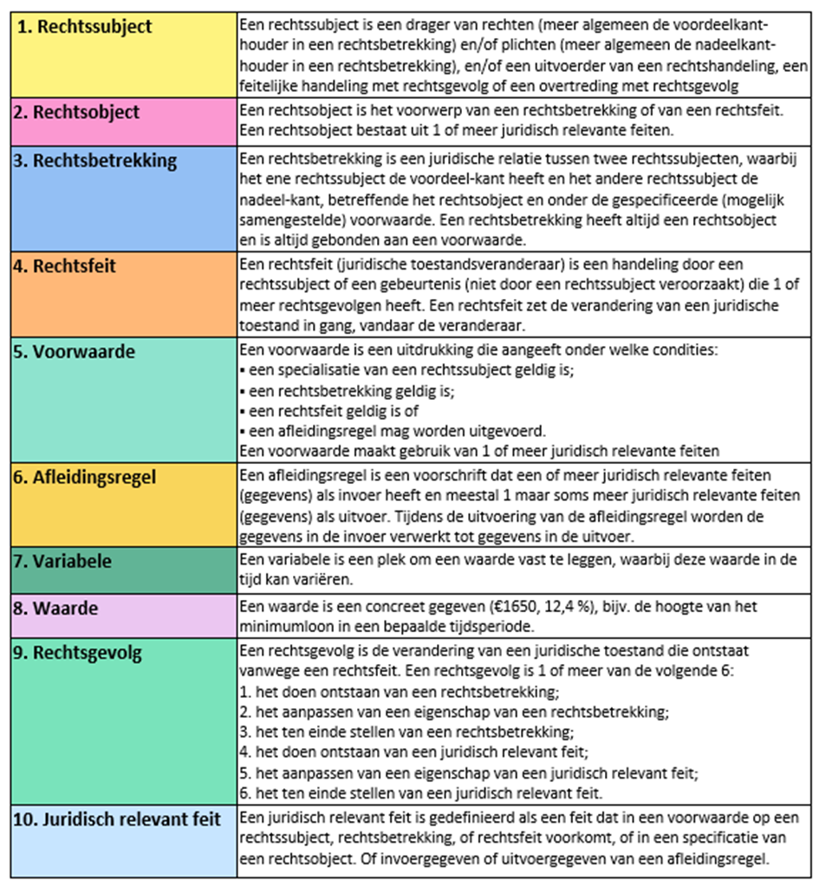

# JRM

## Juridisch Referentiemodel

In 2021 is het boek Wetsanalyse verschenen, waarin het juridisch analyseschema (JAS) wordt beschreven. Sindsdien zijn aan de hand van dit boek projecten bij meerdere organisaties aangevangen. Op basis van de ervaringen in deze projecten is het JAS verbeterd. De verwachting is
dat we in de komende jaren bij toenemende inzet van wetsanalyse, meer feedback kunnen vergaren en zo verdere verbeteringen in het JAS kunnen bewerkstelligen. Daarnaast wordt voorzien dat het toepassingsgebied van het JAS wordt verbreed: van zuiver analyse van bestaande wetgeving, naar
modellering van nieuwe of gewijzigde wetgeving. Om die reden is de term Juridisch Referentiemodel (JRM) meer op zijn plaats.

## Elementen uit het JRM

In onderstaande tabel zijn de omschrijvingen van alle elementen uit het juridisch analyseschema opgenomen.

