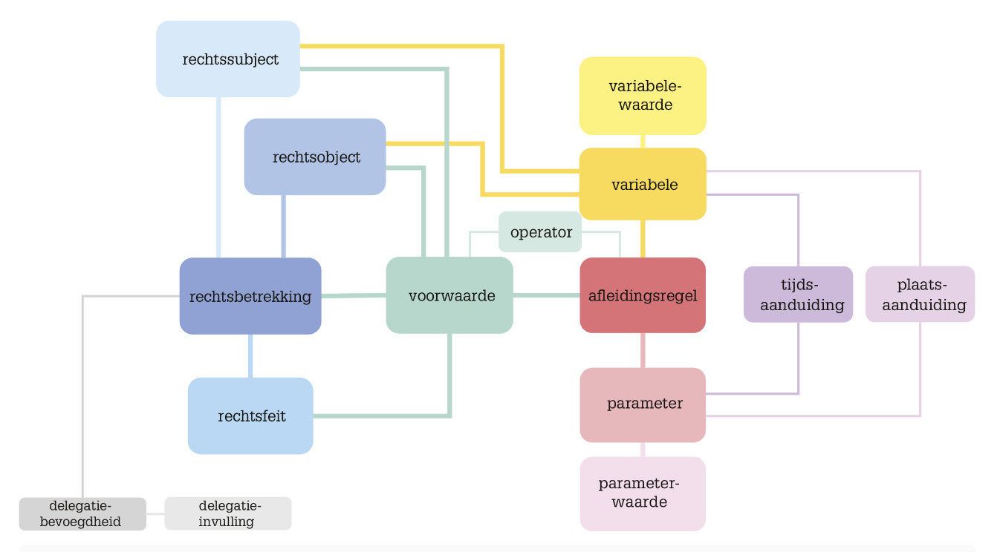

# JAS

## Juridisch Analyschema
Het juridische analyseschema bevat de juridische elementen in wetgeving, met nog enige verfijningen daarin. Het werk van de Amerikaanse jurist Wesley Newcomb Hohfeld [[?HOHFELD]] vormt een belangrijke basis voor het analyseschema. Hij beschreef al in het begin van de twintigste eeuw verschillende soorten rechten en plichten, op basis van Amerikaanse jurisprudentie.61 Vanaf 2012 heeft het samenwerkingsverband de Blauwe Kamer op basis van het werk van Hohfeld een referentiemodel voor wetgeving ontwikkeld.62 Dit referentiemodel is op zijn beurt weer de basis geweest voor het hier gespecificeerde juridische analyseschema.63

Hoofdstuk 4 behandelt het juridisch analyseschema dat gebruikt wordt bij Wetsanalyse en waarin verschillende juridische elementen die in wetgeving voorkomen in samenhang gerangschikt zijn. Deze elementen vormen de klassen die bij Wetsanalyse aan formuleringen in de wetgeving worden toegekend. Het indelen van formuleringen in juridische klassen biedt ondersteuning bij het expliciet maken van de betekenis van die formuleringen.

Hoofdstuk 5 gaat in op de multidisciplinaire samenwerking tussen juristen, informatieanalisten en ICT-ontwikkelaars die essentieel is voor een optimaal resultaat van Wetsanalyse. Zij voeren aan de hand van concrete voorbeelden en scenario’s steeds samen het gesprek over de uitkomsten van de analyse en de interpretatie die daarbij aan de wetgeving is gegeven. Dit is van groot belang voor de kwaliteit van de analyse en daarmee voor de juistheid van de uiteindelijke uitvoering van de wetgeving.

## Elementen uit het JAS

In onderstaande tabel zijn de omschrijvingen van alle elementen uit het juridisch analyseschema opgenomen.

